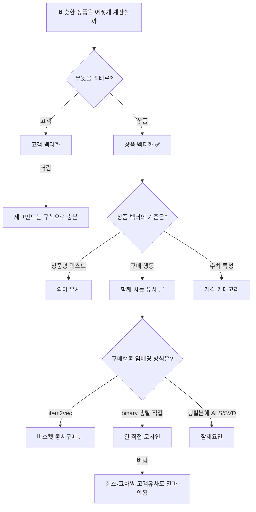

# 상품 임베딩 방법 선정 및 word2vec 방법론

> 이 문서는 **"왜 word2vec(item2vec)을 선택했는가"의 의사결정 흐름**과
> **"word2vec이 어떻게 작동해 유사도를 내는가"의 방법론**만 다룬다.
> 실제 실행 파이프라인(스크립트·폴더·실행법)은 별도 문서로 분리한다.

---

## 1. 배경과 풀려는 문제

SegMind는 **세그먼트로 분류된 고객(우수·충성·일반·이탈위험·신규)에게, 그 세그먼트 맥락 안에서 상품을 추천**하는 것을 목표로 한다.

추천의 핵심은 결국 한 가지 질문으로 모인다.

> **"비슷한 상품"을 어떻게 정의하고, 컴퓨터가 계산할 수 있는 형태로 만들 것인가?**

컴퓨터는 상품명·코드만 보고 "이 상품과 저 상품이 얼마나 비슷한지"를 알 수 없다.
따라서 각 비교 대상을 **숫자 배열(벡터)** 로 바꾼 뒤, 벡터 사이의 거리로 유사도를 재야 한다.
"무엇을, 어떤 기준으로 벡터화할 것인가"가 이 프로젝트의 모든 방법 선택을 갈랐다.

---

## 2. 방법 선정 흐름 (의사결정 3단계)

방법은 세 번의 갈림길을 거쳐 좁혀졌다.

### 2.1 1차 갈림길 — 무엇을 벡터로 만들 것인가 (고객 vs 상품)

세그먼트(우수/충성/…)는 **고객**을 나누는 기준이지만, 그 분류는 RFM 같은 **규칙**으로 충분히 처리된다.
즉 고객은 벡터로 만들 필요 없이 **규칙으로 세그먼트 라벨만** 붙이면 된다.

반면 "세그먼트 안에서 어떤 상품을 추천할지"는 **상품 간 유사도** 문제이므로, **벡터화 대상은 상품**으로 정해졌다.

| 대상 | 처리 방식 | 벡터화 |
| --- | --- | --- |
| 고객 | RFM 등 규칙으로 세그먼트 라벨 부여 | 불필요 |
| 상품 | 임베딩(벡터)으로 변환 후 유사도 계산 | **필요** |

### 2.2 2차 갈림길 — 상품 벡터의 기준 (텍스트 vs 구매행동 vs 수치)

상품을 벡터로 만드는 기준에는 여러 갈래가 있었다.

- **상품명·설명 텍스트 기반**: "텀블러 ↔ 보온병"처럼 *뜻이 비슷한* 상품.
- **구매 행동 기반 (함께 사는)**: 같이 팔리는 상품끼리 가깝게. ← **선택**
- **수치 특성 기반**: 가격대·판매량 등을 직접 조합.

추천의 목적("이 고객이 다음에 살 만한 상품")에는 *의미가 비슷한 것*보다 **실제로 함께/연달아 팔리는 것**이 더 직접적인 신호다.
따라서 **구매 행동 기반**을 택했고, 이에 따라 분석에 불필요한 `description`(상품명 텍스트)과 `country`는 제거했다.

### 2.3 3차 갈림길 — 구매행동 임베딩 방식 (item2vec vs 행렬 기반)

"구매 행동"을 벡터로 바꾸는 방식 안에서도 세 가지를 비교했다.

| 기준 | item2vec (바스켓) | binary 행렬 직접 코사인 | 행렬분해 (ALS/SVD) |
| --- | --- | --- | --- |
| "함께"의 정의 | 같은 **주문**에 담김 | 같은 **고객**이 둘 다 삼 | 같은 고객 + 잠재요인 |
| 고객 패턴 유사도 전파 | 바스켓 문맥 수준 | ❌ 직접 겹침만 | ✅ 잠재요인으로 전파 |
| 희소 데이터 일반화 | 보통 | 약함 | 강함 |
| 빈도 정보 활용 | 있음(동시등장 빈도) | ❌ 0/1로 버림 | △ (구매횟수 행렬 시 ✅) |
| 차원/저장 | 바로 dense(저차원) | 고차원·희소(부적합) | dense로 압축 필요 |
| 구현 직관성 | 높음 | 매우 높음 | 중간 |

**선택: item2vec.** 추천 목적에 가장 잘 맞는 "같은 주문에 함께 담긴 상품" 신호를 직접 학습하고, 별도 차원축소 없이 바로 저차원 dense 벡터가 나오며, 개념·구현이 가장 직관적이기 때문이다.
`binary 행렬 직접 코사인`은 행렬이 극도로 희소(0이 98% 이상)하고 고차원이라 부적합했고, 고객 간 패턴 유사도가 전파되지 않는 한계가 있어 제외했다.
`행렬분해(ALS/SVD)`는 유효한 대안으로 남겨두되(확장 시 검토), MVP 단계에서는 더 직관적인 item2vec을 우선했다.

---

## 3. item2vec을 택한 상세 근거

### 3.1 추천 목적과의 정합성

item2vec은 "같은 주문(영수증)에 함께 담긴 상품"을 가깝게 만든다.
이는 *함께/연달아 사는 패턴*을 그대로 포착하므로, "다음에 살 만한 상품" 추천에 직결된다.

### 3.2 별도 차원축소가 불필요

binary 행렬 방식은 상품 한 개가 "고객 수만큼의 차원(수천 차원) 희소 벡터"가 되어, pgvector 같은 고정 길이 dense 벡터 저장과 맞지 않는다.
이를 쓰려면 행렬분해로 한 번 더 압축해야 한다.
반면 item2vec은 학습 결과가 **처음부터 저차원 dense 벡터(예: 64차원)** 라, 추가 변환 없이 바로 유사도 계산에 쓸 수 있다.

### 3.3 데이터 충분성 검증 결과 (통과)

item2vec은 각 상품이 충분히 반복 등장해야 안정적인 벡터가 나온다. 실제 데이터를 점검한 결과는 다음과 같다.

- 학습 바스켓(주문) 약 **33,836건**, 상품 종류 약 **4,616종**, 총 토큰 약 **76만**
- 상품당 평균 등장 약 **165회**(중앙값 65회) — 단어당 반복이 넉넉함
- 한 주문 전체를 문맥으로 보면 동시등장 학습 쌍이 약 **3,360만 개** — 학습 신호 풍부
- 10회 이상 등장 상품이 **84.5%**, 5회 이상이 **91.5%** — 대부분 안정적 학습 가능
- 드문 상품(5회 미만 약 8%)은 `min_count`로 제외해도 전체 토큰의 0.1%만 빠져 손실이 거의 없음

→ **데이터 양 측면에서 item2vec 학습에 충분**하다는 결론.

### 3.4 추천 일관성을 확보할 수 있음

word2vec 계열은 무작위 초기화 때문에 돌릴 때마다 결과가 달라질 수 있으나, 이는 방법 차원에서 통제 가능하다.

- **재현성**: 시드 고정 + 단일 스레드 학습으로 같은 입력 → 같은 결과 보장
- **안정성**: 한 번 학습한 벡터를 고정해 재사용 → 재학습 전까지 추천이 흔들리지 않음

---

## 4. word2vec(item2vec) 방법론 — 어떻게 작동하는가

### 4.1 핵심 아이디어: 분포 가설

word2vec의 바탕은 언어학의 **분포 가설**이다.

> "단어의 의미는 그 단어가 함께 등장하는 이웃들로 결정된다."
> (You shall know a word by the company it keeps.)

이를 상품에 옮기면: **"상품의 성격은 그 상품과 함께 담기는 다른 상품들로 결정된다."**
즉 같은 장바구니에 자주 함께 담기는 상품끼리는 성격이 비슷하다고 본다.

### 4.2 매핑: 문장 → 주문, 단어 → 상품

word2vec은 원래 "문장 속 단어"를 학습하는 모델이다. 이를 구매 데이터에 그대로 대응시킨 것이 **item2vec**이다.

| 원래 word2vec | item2vec (우리 적용) |
| --- | --- |
| 문장(sentence) | 한 주문(바스켓) |
| 단어(word) | 상품코드(stock_code) |
| 단어가 함께 나오는 문맥 | 같은 주문에 함께 담긴 상품들 |

한 가지 차이: 문장은 단어 순서가 중요하지만, **주문은 담긴 순서가 의미 없다**. 그래서 문맥 범위(window)를 주문 전체로 넓혀, "같은 주문이면 모두 서로의 이웃"으로 본다.

### 4.3 학습 방식: skip-gram + 네거티브 샘플링

학습은 대략 이렇게 일어난다.

1. **중심 상품 하나를 고른다.** (예: 한 주문에서 "텀블러")
2. **그 주문의 다른 상품들(이웃)을 맞히도록** 모델을 조정한다.
   - 텀블러 벡터와 실제 이웃(예: "보온병") 벡터의 **내적(유사도)이 커지도록** 좌표를 조금씩 민다.
3. **네거티브 샘플링**: 모든 상품(약 4,600종)과 일일이 비교하면 무거우므로, 함께 등장하지 *않은* 무작위 상품 몇 개를 "가짜 이웃"으로 뽑아 **그것들과는 멀어지도록** 민다.
4. 이 과정을 모든 주문 × 여러 번(epoch) 반복한다.

반복이 쌓이면:
- **자주 함께 담기는 상품끼리는 벡터가 점점 가까워지고**,
- **함께 등장한 적 없는 상품끼리는 멀어진다.**

결과적으로 각 상품의 벡터에는 "이 상품은 보통 어떤 상품들과 함께 팔리는가"라는 정보가 응축된다.

### 4.4 결과물: 상품마다의 고정 길이 좌표

학습이 끝나면 모든 상품이 **같은 길이의 dense 벡터(예: 64개의 숫자)** 로 표현된다.
이 벡터는 "유사도 공간 속의 한 점(좌표)"이며, 구매 패턴이 비슷한 상품들은 이 공간에서 서로 가까이 모인다.

> 비유: 사람을 "누구와 자주 어울리는가"로 파악해 성향 좌표를 매기는 것과 같다.
> 친구 관계(=함께 담기는 상품)가 비슷하면 좌표도 가까워진다.

참고로 이것은 **단어 꾸러미(bag of words)와는 다르다.** BoW는 "어떤 상품이 들어있는지" 모으기만 할 뿐 상품 간 관계를 모른다.
item2vec은 이웃 관계로부터 **각 상품의 좌표(성격) 자체를 학습**한다.

### 4.5 유사도 검사: 코사인 유사도

두 상품이 얼마나 비슷한지는 두 벡터 사이의 **코사인 유사도**(두 좌표가 이루는 각도)로 잰다.

- 두 벡터가 **같은 방향**일수록(각도가 작을수록) 유사도가 1에 가깝고 = 매우 비슷.
- 방향이 **무관**할수록 0에 가깝다 = 안 비슷.

추천은 이 유사도를 이용한다(개념): 고객이 산 상품들의 좌표로 그 고객의 "취향 좌표"를 만들고, 그와 코사인 유사도가 높은(=가까운) 상품을 가까운 순서대로 고른다.
세그먼트 맥락은 후보 상품의 범위를 그 세그먼트가 실제 구매하는 상품들로 좁히는 방식으로 반영한다.

---

## 5. 한 줄 요약

> 고객은 규칙으로 세그먼트만 나누고, **상품을 "함께 사는 패턴"으로 벡터화**하기 위해
> **item2vec(바스켓에 word2vec 적용)** 을 선택했다.
> item2vec은 *분포 가설*에 따라 "같은 주문에 함께 담긴 상품끼리 좌표가 가까워지도록" 학습하며,
> 학습된 좌표 사이의 **코사인 유사도**로 비슷한 상품을 찾아 추천한다.
