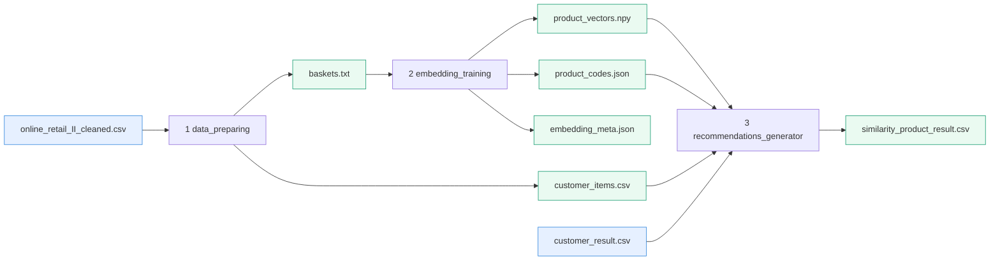

# SegMind 추천 파이프라인 — 실제 프로세스 흐름

> 이 문서는 **실제 코드가 어떻게 돌아가는지(실행 프로세스)** 를 단계별로 정리한다.
> "왜 word2vec을 골랐는가 / word2vec 원리"는 별도 문서(`method_selection_word2vec.md`)를 참고.

---

## 0. 구조와 실행 순서

```
프로젝트 루트/
├── codes/                         ← 코드
│   ├── data_preparing.py
│   ├── embedding_training.py
│   ├── recommendations_generator.py
│   └── db_loader.py               (DB 적재용 — 현재 범위 밖, 본 문서는 3단계까지)
└── data/
    ├── input/                     ← 직접 넣는 입력
    │   ├── online_retail_II_cleaned.csv
    │   └── customer_result.csv     (이미 분류된 세그먼트)
    └── output/                    ← 스크립트가 생성하는 중간/최종 산출물
```

**실행 순서**

```
data_preparing.py → embedding_training.py → recommendations_generator.py
```

> DB 적재(`db_loader.py`)는 이번 범위에서 제외한다. 본 파이프라인은 **3단계까지**(= `similarity_product_result.csv` 생성)를 다룬다.

모든 스크립트는 자기 파일 위치 기준으로 `data/` 를 찾으므로(`ROOT = Path(__file__).parent.parent`), 어느 폴더에서 실행해도 경로가 맞는다.

---

## 1. 전체 데이터 흐름 (한눈에)



핵심 한 줄: **거래 CSV → 주문 묶음(바스켓) → 상품 좌표 → 세그먼트 안에서 코사인 추천 → 추천 결과 CSV.**

---

## 2. 단계별 상세

### 2.1 `data_preparing.py` — 데이터 준비

| 항목 | 내용 |
| --- | --- |
| 입력 | `data/input/online_retail_II_cleaned.csv` (인자로 다른 경로 지정 가능) |
| 출력 | `data/output/baskets.txt`, `data/output/customer_items.csv` |

처리 과정:

1. **CSV 로드.** `stock_code`, `customer_id`, `invoice_id` 를 **문자열로 고정**해서 읽는다. (`'79323P'` 같은 코드가 숫자로 추론돼 키가 어긋나는 것을 막기 위함.)
2. **불필요 컬럼 제거.** `country`, `description` 을 제거한다(있을 때만). item2vec은 상품명 텍스트를 쓰지 않고 "같은 주문에 어떤 코드가 함께 담겼는가"만 보기 때문.
3. **바스켓 코퍼스 생성.** 주문(`invoice_id`)별로 `stock_code` 목록을 만든다. 한 주문 안 중복 상품은 1번만 담고, **상품이 1종뿐인 주문은 제외**(동시구매 신호가 없어 학습에 무의미). → `baskets.txt` (한 줄 = 한 주문).
4. **고객별 구매 목록 생성.** `(customer_id, stock_code)` 중복 제거 쌍을 저장. 추천 단계에서 "고객 취향 좌표" 계산에 쓰인다. → `customer_items.csv`.

예상 로그: `[준비] 바스켓 33,836건 ... / 고객-상품 구매쌍 481,019건 ...`

### 2.2 `embedding_training.py` — item2vec 임베딩 학습

| 항목 | 내용 |
| --- | --- |
| 입력 | `data/output/baskets.txt` |
| 출력 | `data/output/product_vectors.npy`, `product_codes.json`, `embedding_meta.json` |

하이퍼파라미터(코드값과 이유):

| 파라미터 | 값 | 이유 |
| --- | --- | --- |
| `DIM` | 64 | 데이터 규모(토큰 ~76만)에 64면 충분. 키우면 희소 상품 과적합. |
| `WINDOW` | 999 | 주문 안에선 순서 무의미 → 주문 전체를 한 상품의 문맥으로. |
| `MIN_COUNT` | 5 | 5회 미만 상품은 좌표 불안정 → 제외(상품 8%·토큰 0.1%만 빠짐). |
| `SG` | 1 | skip-gram. 드문 동시구매 조합까지 잡는 데 유리. |
| `NEGATIVE` | 10 | 네거티브 샘플링 수. 소규모 코퍼스에서 안정적. |
| `EPOCHS` | 30 | 코퍼스가 작아 여러 번 반복 학습. |
| `SEED` / `workers` | 42 / 1 | **재현성**: 단일 스레드 + 고정 시드로 같은 입력 → 같은 결과. |

처리 과정:

1. `baskets.txt` 를 읽어 word2vec(item2vec) 학습. `EpochLogger` 콜백이 epoch마다 진행 상황을 출력.
2. 학습된 상품 좌표를 추출한 뒤 **L2 정규화**(단위벡터). 이렇게 하면 이후 단계에서 **내적 = 코사인 유사도**가 되어 계산이 단순해진다.
3. 세 파일로 저장: 좌표 행렬(`.npy`), 행↔`stock_code` 매핑(`product_codes.json`), 메타(`embedding_meta.json`, `model_version` 등).
4. **한 번만 학습 → 파일 고정 → 이후 재사용.** 이게 추천 일관성의 핵심(매번 재학습하면 결과가 흔들림).

`model_version` = `item2vec_v1_YYYYMMDD` (재학습 추적용 식별자).

### 2.3 `recommendations_generator.py` — 추천 생성

| 항목 | 내용 |
| --- | --- |
| 입력 | `product_vectors.npy`, `product_codes.json`, `embedding_meta.json`(임베딩 산출물), `data/output/customer_items.csv`, `data/input/customer_result.csv` |
| 출력 | `data/output/similarity_product_result.csv` |
| 출력 컬럼 | `customer_id, stock_code, similarity_score, rank, match_reason` |
| 주요 상수 | `TOP_N = 3`(API top_k 기본값과 동일), `CO_PURCHASE_THRESHOLD = 0.5` |

추천 계산(고객 1명 기준):

1. **세그먼트 후보 풀 구성.** 세그먼트별로 "그 세그먼트 고객들이 산 상품" 집합을 미리 만든다. → 추천은 이 풀 안에서만 고른다(= 세그먼트 맥락 반영).
2. **고객 취향 좌표(centroid).** 그 고객이 산 상품들의 좌표 **평균** → 다시 단위벡터로 정규화.
3. **후보 점수 = 코사인 유사도.** 후보 상품 좌표와 취향 좌표의 내적(단위벡터라 코사인). 이미 산 상품은 후보에서 제외.
4. **상위 `TOP_N`(=3) 선택**, 유사도 내림차순 정렬해 `rank` 부여.

`match_reason`(JSON) 생성 — 추천 1건마다:

- **`co_purchased_with` / `source`**: 추천 상품과 가장 가까운 '이미 산 상품'을 찾아 그 유사도가
  - `≥ 0.5` 이면 → `source = "동시구매"`, `co_purchased_with =` 그 상품 코드 (특정 상품과의 연관이 추천을 끌었다고 해석)
  - `< 0.5` 이면 → `source = "세그먼트선호"`, `co_purchased_with = null` (세그먼트 전반 취향이 끌었다고 해석)
- **`segment_support`**: 그 세그먼트 고객 중 이 상품을 산 비율(0~1). (분모 = 세그먼트 전체 고객 수)

> 이 키 체계는 API 명세서의 `match_reason` 구조를 그대로 따른다. 산출물은 이후 Agent/Spring으로 전달된다.
> `model_version` 은 CSV 컬럼에는 넣지 않고 추적용 로그로만 남긴다.

예상 로그: `[추천] 생성 완료: 고객 5,851명 / 행 17,553개 ...` (고객 약 5,851명 × 최대 3개)

### 2.4 (이후 단계) DB 적재 — 현재 범위 밖

DB 적재(`db_loader.py`)는 이번 범위에서 제외하며, 파이프라인은 3단계 산출물인 `similarity_product_result.csv` 까지로 마무리한다.

> **확정 사항 (추후 적재 시 적용):** 이 CSV를 DB `similarity_product_result` 테이블에 적재할 때, 산출물의 `match_reason` 을 받기 위해 테이블에 **`match_reason JSONB`** 컬럼을 추가한다.
> 즉 테이블 컬럼은 기존 `recommend_id, customer_id, stock_code, similarity_score, rank, created_at` 에 **`match_reason JSONB`** 가 더해진 형태가 된다. (`recommend_id`·`created_at` 은 DB가 자동 생성.)

---

## 3. 산출물 명세

| 파일 | 생성 단계 | 내용 |
| --- | --- | --- |
| `baskets.txt` | 1 | 한 줄 = 한 주문의 상품코드 목록(학습 코퍼스) |
| `customer_items.csv` | 1 | `(customer_id, stock_code)` 구매 쌍 |
| `product_vectors.npy` | 2 | 상품 좌표 행렬 (N×64, L2 정규화) |
| `product_codes.json` | 2 | 행 순서 ↔ `stock_code` 매핑 |
| `embedding_meta.json` | 2 | `model_version`, 차원, 상품 수 등 메타 |
| `similarity_product_result.csv` | 3 | 최종 추천: `customer_id, stock_code, similarity_score, rank, match_reason` |

---

## 4. 일관성·확장 메모

- **일관성**: 입력(좌표 파일 + 데이터)이 고정이고 numpy 연산이 결정적이므로, 같은 입력이면 항상 같은 추천이 나온다. 결과를 CSV로 저장해 두면 재생성 전까지 추천이 고정된다.
- **재학습**: 데이터가 늘면 1→2→3 을 다시 실행(2단계에서 `model_version` 이 새로 찍힘). 단, 현재 최종 산출물(CSV)에는 `model_version` 이 들어가지 않으므로, 추후 DB 적재 시 버전 추적이 필요하면 컬럼 추가를 검토한다.
- **세그먼트 의존**: 3단계는 `data/input/customer_result.csv`(이미 분류된 세그먼트)가 있어야 동작한다.
